# Complete Git Commands Guide

> 💡 Quick reference + practical guide for daily Git usage

This guide explains Git commands in a simple and practical way, with examples. No prior Git knowledge is required.

---

## 🧠 Git Mental Model (IMPORTANT)

Git has 3 main areas:

1. **Working Directory** → your files
2. **Staging Area (Index)** → selected changes (`git add`)
3. **Repository** → committed snapshots

Flow:

```text
edit files → git add → git commit
```

---

## 📚 Quick Navigation

| Section | Description |
|---------|-------------|
| [📄 Technical Report](#-technical-report) | Full technical report — architecture, development phases, metrics and design decisions |
| [🐳 Container Documentation](#-container-documentation) | Dockerfile analysis and Podman commands for all 3 containers |
| [🔧 Prerequisites](#-prerequisites) | First-time setup |
| [🚀 Start a project - create and clone](#-start-a-project---create-and-clone) | Create or clone a repository |
| [📝 Essentials — save your work](#-essentials--save-your-work) | Daily commands |
| [🧹 Manage files & .gitignore](#-manage-files--gitignore) | File tracking |
| [🌿 Branching — work in parallel](#-branching--work-in-parallel) | Work in parallel |
| [🔀 Merge & Rebase](#-merge--rebase-integrate-changes) | Integrate changes |
| [📦 Stash (temporarily save work)](#-stash-temporarily-save-work) | Temporary saves |
| [📤 Share & Update (GitHub)](#-share--update-github) | Remote operations |
| [🔧 Common fixes](#-common-fixes) | Troubleshooting |
| [👥 Team workflow (personal branches)](#-team-workflow-personal-branches) | Collaboration guide |
| [🔬 Advanced Commands](#-advanced-commands) | Expert tools |
| [🐳 Podman Container Instructions](#-podman-container-instructions) | Build and run containers |
| [📊 Root Architecture Graph](#-root-architecture-graph) | Complete system architecture diagram and generation commands |
| [📖 How to view this README](#-how-to-view-this-readme) | Viewing instructions |

---

## 📄 Technical Report

A full technical report covering architecture, development phases, metrics, and design decisions is available here:

> 📄 [FastBuyWave · Technical Development Report (PDF)](./FastBuyWave_TechnicalReport.pdf)
>
> *💡 **VS Code users:** Install the [PDF Viewer extension](https://marketplace.visualstudio.com/items?itemName=tomoki1207.pdf) to read PDFs directly in the editor.*

---

## 🐳 Container Documentation

Full documentation for all 3 containers — Dockerfile analysis, build strategy, and Podman commands — is available here:

> 📄 [FastBuyWave · Container Documentation (PDF)](./FastBuyWave_Container_Docs.pdf)
>
> *Covers: Angular Frontend, Spring Boot Backend, Python Email Server — built and managed independently with Podman on Linux. No Docker Compose.*
>
> *💡 **VS Code users:** Install the [PDF Viewer extension](https://marketplace.visualstudio.com/items?itemName=tomoki1207.pdf) to read PDFs directly in the editor.*

---

## 🔧 Prerequisites

### Install Git

| Platform | Command / Link |
|----------|----------------|
| **Windows** | Download from [git-scm.com](https://git-scm.com/download/win) or use `winget install Git.Git` |
| **macOS** | `brew install git` (with Homebrew) or download from [git-scm.com](https://git-scm.com/download/mac) |
| **Linux** | `sudo apt install git` (Ubuntu/Debian) or `sudo dnf install git` (Fedora) or `sudo pacman -S git` (Arch/Manjaro) |

### First-time setup (do this once)

```bash
# Identity (required for commits)
git config --global user.name "Your Name"   # Git uses this in commit metadata
git config --global user.email "your.email@example.com"

# Choose ONE editor: (optional)
git config --global core.editor "code --wait"   # VS Code opens editor and waits
git config --global core.editor "nvim"          # Neovim alternative

# Default branch (optional)
git config --global init.defaultBranch main

# Verify configuration
git config --list
```

---

## 🚀 Start a project - create and clone

| Command | What it does | When to use it |
|--------|--------------|----------------|
| `git init` | Creates a Git repository (`.git`) and starts tracking changes. | Start a new project. |
| `git clone git@github.com:username/repo.git` | Downloads a project using SSH (more secure). | Work on an existing project. |
| `git clone https://github.com/username/repo.git` | Downloads a project using HTTPS (no SSH, uses PAT). | Prefer HTTPS or no SSH setup. |

---

## 📝 Essentials — save your work

Think of Git as a camera: each commit is a snapshot.

| Command | What it does | When to use it |
|--------|--------------|----------------|
| `git status` | Shows modified, staged, or untracked files. | Always check before committing. |
| `git add file.txt` | Stages a specific file. | Save one file. |
| `git add -A` | Stages all changes including deletions. | Save everything in repo. |
| `git commit -m "message"` | Creates a snapshot of staged changes. | After completing a task. |
| `git commit -am "message"` | Stages modified tracked files + commits in one step. Does NOT include new (untracked) files. | Quick commits when you're only editing existing files. |
| `git mv old.txt new.txt` | Renames/moves a file, keeping history clean. | Rename or move files. |
| `git rm file.txt` | Deletes a file and stages deletion. | Remove unwanted file. |
| `git restore file.txt` | Restore a file to last committed state. | Undo unwanted changes to a file. |
| `git restore --staged file.txt` | Unstage a file but keep changes. | Undo accidental `git add`. |
| `git rm --cached file.txt` | Stop tracking a file but keep locally; then add to `.gitignore`. | Remove sensitive or mistakenly added files. |
| `git diff` | Shows unstaged changes. | See what you modified before staging. |
| `git diff --staged` | Shows staged changes. | Verify what will be committed. |
| `git log --oneline --graph --all` | Shows commit history visually. | Understand project history. |

> 💡 Difference:
>
> - `git add .` → adds changes in current directory (not always deletions outside it)
> - `git add -A` → stages ALL changes (recommended for consistency)

> **Note:** For advanced file management (`git rm -r --cached .`), see 🔬 [Advanced Commands](#-advanced-commands) → File Management.

### ⚡ Shortcuts / Aliases
```bash
git st        # shortcut for status
git co        # shortcut for checkout
git ci        # shortcut for commit
git br        # shortcut for branch
git unstage   # shortcut for restore --staged
git lg        # shortcut for fancy log
```

---

## 🧹 Manage files & .gitignore

| Command | What it does | When to use it |
|--------|--------------|----------------|
| `git ls-files` | Lists all tracked files. | Check what Git controls. |
| `git clean -n` | Shows untracked files that would be deleted. | Preview cleanup. |
| `git clean -fd` | Deletes untracked files & empty folders. | Remove temporary/junk files completely. |
| `echo "node_modules/" >> .gitignore` | Adds a line to `.gitignore`. | Ignore files/folders. |
| `git check-ignore -v node_modules/` | Shows which line in `.gitignore` ignores a file. | Debug why a file is ignored. |

> ⚠️ **Warning:** `git clean -fd` permanently deletes untracked files. They cannot be recovered.

---

## 🌿 Branching — work in parallel

| Command | What it does | When to use it |
|--------|--------------|----------------|
| `git branch` | Lists local branches. | Orient yourself. |
| `git branch name` | Creates a branch without switching. | Prepare new feature branch. |
| `git checkout -b name` | Create and switch to new branch. | Start working on a feature. |
| `git checkout name` | Switch to existing branch. | Change current branch. |
| `git branch -d name` | Deletes local branch (if merged). | Clean up finished features. |
| `git push origin --delete name` | Deletes remote branch. | Remove obsolete remote branch. |

> 💡 Modern alternative to `git checkout`:
> ```bash
> git switch branch-name        # switch branch
> git switch -c new-branch      # create + switch
> ```
>
> **Alternative syntax for deleting remote branch:**
> ```bash
> git push origin --delete branch-name
> ```
>
> 🧠 Tip: Always create a new branch for every feature/fix:
> ```bash
> git switch -c feature/login
> ```
> Keeps work isolated and avoids breaking `develop`.

---

## 🔀 Merge & Rebase (integrate changes)

| Command | What it does | When to use it |
|--------|--------------|----------------|
| `git merge name` | Integrates changes from branch `name`. | Merge finished features. |
| `git merge --no-ff name` | Keep merge commit for visibility. | Make merges more visible in history. |
| `git rebase name` | Moves commits on top of `name` branch (linear history). | Keep history clean. **Do not rebase shared branches.** |
| `git fetch` | Downloads commits/branches from remote without merging. | Inspect remote changes safely. |
| `git pull` | Fetches + merges remote changes (`git fetch + git merge`). | Quick update from remote. |
| `git pull --rebase` | Fetches & rebases remote changes. | Keep personal branch history linear. Safer alternative to `git pull`. |
| `git cherry-pick commit-hash` | Applies a specific commit from another branch. | Apply a single change without merging the whole branch. |

> ⚠️ **Warning:** `git pull` directly on shared branches equals `git fetch` + `git merge` and may create unwanted merge commits. Prefer `git pull --rebase` or `git fetch` + `git rebase` for a cleaner history.

> **Tip:** For advanced merge & rebase commands (`--abort`, `--continue`), see **Advanced Commands → Merge & Rebase**.

---

## 📦 Stash (temporarily save work)

| Command | What it does | When to use it |
|--------|--------------|----------------|
| `git stash` | Saves changes temporarily. | Need to switch branches urgently. |
| `git stash push -m "description"` | Save changes with a descriptive name. | Track multiple stashes. |
| `git stash pop` | Restores last stash & removes it. | Resume work. |
| `git stash apply` | Restores stash but keeps it. | Apply stash to multiple branches. |
| `git stash drop` | Deletes last stash without restoring. | Clean up unused stashes. |

> **Tip:** Include untracked or ignored files using `-u` or `-a`. See **Advanced Commands → Stash**.

---

## 📤 Share & Update (GitHub)

| Command | What it does | When to use it |
|--------|--------------|----------------|
| `git remote -v` | Shows remote connections. | Verify connections. |
| `git remote add origin git@github.com:user/repo.git` | Link local repo to GitHub. | After `git init`. |
| `git push origin branch-name` | Uploads branch. | Share work. |
| `git push -u origin branch-name` | Sets upstream for first push. | First push of branch. |
| `git push` | Push changes. | Subsequent pushes. |
| `git fetch` | Downloads commits/branches without merging. | Inspect remote changes. |
| `git fetch --prune` | Removes deleted remote branches. | Clean remote branch list. |

### ⚠️ Force push

| Command | What it does | When to use it |
|--------|--------------|----------------|
| `git push --force` | Overwrites remote branch. **Dangerous!** | After rebase/amend on personal branch only. |
| `git push --force-with-lease` | Safer force push: checks remote before overwriting. | Use when necessary. |

> ⚠️ **Warning:** Never use `--force` on shared branches (e.g., `main`, `develop`).

---

## 🔧 Common fixes

| Problem | Solution |
|---------|----------|
| Wrong commit message | `git commit --amend -m "new message"` |
| Forgot a file | `git add file.txt` + `git commit --amend --no-edit` |
| Committed to wrong branch | `git reset --mixed HEAD~1` + `git checkout correct-branch` + `git cherry-pick` |
| Delete last commit but keep changes | `git reset --soft HEAD~1` (traditional)<br>or `git reset --mixed HEAD~1` then `git restore --staged .` (modern approach) |
| Delete last commit completely | `git reset --hard HEAD~1` |
| Pushed sensitive file | `git rm --cached file.txt` → `.gitignore` → `git commit` → `git push` → **change password** |

> ⚠️ **Warning:** `git reset --hard` permanently deletes commits and changes. Cannot be undone.

---

## 👥 Team workflow (personal branches)

Everyone works on their own branch; `develop` is the shared integration branch.

### 💡 Assumptions
- `develop` is updated via Pull Requests (recommended)
- Developers rebase locally before pushing
- Only finished features are merged into `develop`

| Step | You (developer) | Server / Team | Notes |
|------|-----------------|---------------|-------|
| 1 | `git fetch origin`<br>`git rebase origin/develop` | Updates your local `develop` | Always start by updating `develop` |
| 2 | `git checkout your-branch && git rebase origin/develop` | | Rebase your feature branch on top of latest `develop` |
| 3 | Work & commit | | Perform your tasks locally |
| 4 | `git push -u origin your-branch` | Updates remote | First push sets upstream |
| 5 | | Colleague pushes their feature branch | They work on their own branches |
| 6 | | Colleague opens Pull Request to merge feature into `develop` | Merging happens via PR, not locally |
| 7 | `git fetch origin`<br>`git rebase origin/develop` | Updates your local `develop` | Keep your branch in sync with merged features |
| 8 | `git checkout your-branch && git rebase origin/develop && git push` | Updates remote | Rebase your branch again before continuing work |
| 9 | `git checkout develop`<br>`git fetch origin`<br>`git rebase origin/develop` | Updates local `develop` | Get all merged features from remote safely |

### 🧠 Tip
- Always rebase your feature branch before pushing to avoid conflicts  
- Use Pull Requests to merge into `develop` rather than merging locally  
- Never force push to shared branches like `develop` or `main`

### ASCII Workflow Example

```text
develop:      A──B──C
                \
your-branch:     D──E

After rebase:

develop:      A──B──C
                    \
your-branch:         D'──E'
```

> **💡 Note:** Commits `D'` and `E'` have different hashes from `D` and `E`. During a rebase, Git rewrites history and creates new commits. This is normal and desirable for maintaining a linear history, but it is the reason **you should not rebase branches shared with other colleagues**.

**How to resolve conflicts during rebase:**
1. Open files with conflicts (`<<<<<<<` / `>>>>>>>`)  
2. Choose version to keep or combine  
3. `git add .`  
4. `git rebase --continue` (see **Advanced Commands → Merge & Rebase**)  

**Golden rules**
- Update `develop` & rebase before working  
- Rebase before pushing to keep history linear  
- Only merge finished features  
- Avoid `--force` on shared branches  

---

## 🔬 Advanced Commands

> 🧠 Golden rules (Team-friendly)
> - Always update `develop` and rebase your feature branch **before starting work**
> - Rebase your branch **before pushing** to keep a linear history
> - Only merge **finished features** into shared branches
> - ⚠️ Never use `--force` on shared branches like `main` or `develop`
> - If you need to force push on a personal branch, prefer:
>   ```bash
>   git push --force-with-lease
>   ```
>   This checks that the remote hasn't changed unexpectedly, making it safer

### File Management

| Command | What it does |
|---------|--------------|
| `git rm -r --cached .` | Stop tracking all files, then re-add only unignored files. |
| `git update-index --assume-unchanged file.txt` | Temporarily ignores changes. |
| `git update-index --no-assume-unchanged file.txt` | Revert above. |
| `git ls-files --others --ignored --exclude-standard` | List ignored files. |

### Stash

| Command | What it does |
|---------|--------------|
| `git stash -u` | Saves changes + untracked files. |
| `git stash -a` | Saves changes + ignored files. |
| `git stash show -p stash@{0}` | Inspect stash contents. |

### Merge & Rebase

| Command | What it does |
|---------|--------------|
| `git merge --abort` | Cancel conflicted merge. |
| `git rebase --continue` | Continue after conflicts. |
| `git rebase --abort` | Cancel rebase. |

### Recovery

| Command | What it does |
|---------|--------------|
| `git reset --hard commit-hash` | Reset project to specific commit. |
| `git restore --source=HEAD~1 file.txt` | Restore file to previous commit. |

> **Note:** For `git clean -fd` see 🧹 [Manage files & .gitignore](#-manage-files--gitignore) for details.

---

## 🐳 Podman Container Instructions

Below are the essential Podman commands for building, running, and managing containers in the FastBuyWave project.

| Command | Description |
|---------|-------------|
| `podman build -t fastbuy-frontend .` | 🏗️ Build the Angular frontend image (includes my-lib-inside library). |
| `podman build -t fastbuy-backend .` | 🏗️ Build the Spring Boot backend image. |
| `podman build -t fastbuy-email-server .` | 🏗️ Build the Python email server image. |
| `podman run -it --rm -p 4200:4200 fastbuy-frontend /bin/bash` | 🚀 Run the frontend container interactively. Auto-removes on exit. |
| `podman run -it --rm -p 8080:8080 fastbuy-backend /bin/bash` | 🚀 Run the backend container interactively. Auto-removes on exit. |
| `podman run -it --rm -p 8025:8025 fastbuy-email-server /bin/bash` | 🚀 Run the Python email server container interactively. Auto-removes on exit. |
| `podman rmi -f fastbuy-frontend` | 🗑️ Force remove the frontend image. |
| `podman rmi -f fastbuy-backend` | 🗑️ Force remove the backend image. |
| `podman rmi -f fastbuy-email-server` | 🗑️ Force remove the email server image. |
| `podman rmi -f <image-hash>` | 🗑️ Force remove any image by its hash ID. |

> 📦 **Images are available on Docker Hub:** [https://hub.docker.com/](https://hub.docker.com/)

> 📄 For full Dockerfile analysis and build strategy, see [Container Documentation](#-container-documentation).

---

## 📊 Root Architecture Graph

### Graph Generation Commands

| Command | Description |
|---------|-------------|
| `python generate_root_graph.py` | Generates the root architecture graph |
| `mmdc -i graphs/root-graph.mmd -o graphs/root-graph.svg -w 4000 -H 3000` | Converts to SVG using Mermaid CLI |

### Preview



---

## 📖 How to view this README

This document is written in **Markdown**. To view it correctly:

### ✅ Visual Studio Code

1. Open this file in VSCode  
2. Press `Ctrl + Shift + V` (Windows/Linux) or `Cmd + Shift + V` (macOS)  
3. Preview opens with proper formatting

**No installation needed** — VSCode has built-in Markdown preview.


