# FAST BUY WAVE — Email Intermediary Server

[](https://python.org)
[](LICENSE)
[](https://tools.ietf.org/html/rfc5321)

An SMTP intermediary server with automatic reply blocking, designed to handle email communications in automated environments.

---

## Table of Contents

- [Architecture](#architecture)
- [Prerequisites](#prerequisites)
- [Installation](#installation)
- [Configuration](#configuration)
- [Starting the Server](#starting-the-server)
- [Components](#components)
- [API Reference](#api-reference)
- [Workflow](#workflow)
- [Usage Examples](#usage-examples)
- [Protection Headers](#protection-headers)
- [Statistics](#statistics)
- [Documentation](#documentation)
- [Troubleshooting](#troubleshooting)
- [Project Structure](#project-structure)
- [Architecture Graph](#architecture-graph)


---

## Architecture

```
Sender ──▶ SMTP Server (localhost:1234) ──▶ Gmail Relay (smtp.gmail.com:587) ──▶ Recipient
                    │
                    ▼
           Anti-Reply Detection
                    │
           ┌────────┴────────┐
           │                 │
        FORWARD            BLOCK
        + headers     + rejection msg

  [Optional] Auto-Reply Bot (Gmail API)
  Reads unread emails and sends automatic replies
```

---

## Prerequisites

| Requirement   | Version | Description                              |
|---------------|---------|------------------------------------------|
| Python        | 3.8+    | Runtime environment                      |
| Gmail Account | —       | For SMTP relay (requires app password)   |
| Port 1234     | —       | Local port for the SMTP server           |

---

## Installation

```bash
# 1. Clone the repository
git clone <repository-url>
cd ServerEmailPython

# 2. Create virtual environment (recommended)
python -m venv venv
source venv/bin/activate    # Linux/Mac
venv\Scripts\activate       # Windows

# 3. Install dependencies
pip install aiosmtpd python-dotenv google-auth google-auth-oauthlib google-auth-httplib2 google-api-python-client
```

---

## Configuration

Create a `.env` file in the project root:

```env
RELAY_EMAIL=youraccount@gmail.com
RELAY_PASSWORD=abcd1234xyz
```

> `RELAY_PASSWORD` must be a **Gmail App Password** (16 characters), not your regular account password.

### Obtaining a Gmail App Password

1. Go to [Google Account](https://myaccount.google.com)
2. **Security** → **2-Step Verification** → enable it
3. **App passwords** → select **Mail** and **Windows Computer**
4. Copy the generated 16-character password

---

## Starting the Server

```bash
python server.py
```

Expected output:

```
SMTP INTERMEDIARY SERVER WITH REPLY BLOCKING
═══════════════════════════════════════════════════════════════
Intermediary server active on localhost:1234
Initial statistics: Forwarded=0, Blocked replies=0
Ctrl+C to stop
```

---

## Components

### 1. SMTP Intermediary Server — `server.py`

Main server that receives emails, analyzes them, and forwards or blocks them.

| Method                        | Description                                      |
|-------------------------------|--------------------------------------------------|
| `handle_DATA()`               | Entry point for incoming emails                  |
| `is_reply_to_intermediary()`  | Detects if the email is a reply to the system    |
| `forward_with_protection()`   | Forwards the email with anti-reply headers       |
| `send_rejection_message()`    | Sends a rejection notice to repliers             |
| `track_forwarded_email()`     | Tracks forwarded emails for future blocking      |

---

### 2. Auto-Reply Bot — `gmail_auto_reply.py`

Optional bot that reads unread emails and sends automatic replies via Gmail API.

| Function                    | Description                            |
|-----------------------------|----------------------------------------|
| `gmail_authenticate()`      | OAuth2 authentication with Gmail       |
| `list_unread_messages()`    | Retrieves unread messages              |
| `process_unread_messages()` | Processes and replies to messages      |
| `run_auto_reply_daemon()`   | Continuous email checking loop         |

---

## API Reference

### SMTP Commands

| Command     | Description             | Example                                          |
|-------------|-------------------------|--------------------------------------------------|
| `EHLO`      | Initial handshake       | `EHLO client`                                    |
| `MAIL FROM` | Specify sender          | `MAIL FROM:<sender@example.com>`                 |
| `RCPT TO`   | Specify recipient       | `RCPT TO:<recipient@gmail.com>`                  |
| `DATA`      | Send email content      | `DATA\r\nSubject: Test\r\n\r\nBody\r\n.\r\n`    |

### Response Codes

| Code | Meaning                          |
|------|----------------------------------|
| 250  | Email accepted and forwarded     |
| 550  | Email blocked (reply detected)   |
| 451  | Temporary failure                |

---

## Workflow

### Legitimate Email — forwarded

```
1. Sender → localhost:1234
2. Analysis: NO reply indicators detected
3. Add protection headers:
   - Reply-To: noreply-blocked-{timestamp}@invalid-domain.local
   - Auto-Submitted: auto-generated
   - X-Block-Replies: true
4. Forward via Gmail SMTP
5. Track sender for future blocking
```

### Reply Email — blocked

```
1. Sender → localhost:1234
2. Analysis: YES reply indicators detected
   - Subject contains "Re:" or "Risposta:"
   - OR In-Reply-To header present
   - OR sender was previously forwarded to
3. Block email
4. Send rejection message to sender
5. Increment blocked_replies counter
```

---

## Usage Examples

### Sending Email with Python

```python
import smtplib
from email.mime.text import MIMEText

msg = MIMEText("Message content")
msg['From'] = "sender@example.com"
msg['To'] = "recipient@gmail.com"
msg['Subject'] = "Email Subject"

with smtplib.SMTP('localhost', 1234) as server:
    server.send_message(msg)
```

### Testing with Telnet

```bash
telnet localhost 1234
EHLO test
MAIL FROM:<test@example.com>
RCPT TO:<recipient@gmail.com>
DATA
Subject: Test Email

This is a test.
.
QUIT
```

### Starting the Auto-Reply Bot

```bash
python gmail_auto_reply.py
```

---

## Protection Headers

Every forwarded email receives the following headers to prevent replies:

| Header                      | Value                                                | Purpose                          |
|-----------------------------|------------------------------------------------------|----------------------------------|
| `Reply-To`                  | `noreply-blocked-{timestamp}@invalid-domain.local`   | Prevents direct replies          |
| `Auto-Submitted`            | `auto-generated`                                     | Identifies automated email       |
| `X-Auto-Response-Suppress`  | `All`                                                | Disables automatic responses     |
| `Precedence`                | `bulk`                                               | Low priority indicator           |
| `X-Block-Replies`           | `true`                                               | Internal block flag              |
| `Return-Path`               | `<>`                                                 | Null return path                 |

---

## Statistics

The server tracks real-time statistics printed every 5 minutes:

```python
{
    "forwarded": 0,        # Successfully forwarded emails
    "blocked_replies": 0   # Detected and blocked replies
}
```

---

## Documentation

This project uses **pdoc** to auto-generate HTML documentation from Python docstrings.

### Installation

```bash
python -m pip install pdoc
```

### Generate documentation

```bash
python -m pdoc server gmail_auto_reply --output-dir docs
```

This creates a `docs/` folder with HTML files for each module.

### Regenerate documentation

Re-run the same command — it overwrites the existing `docs/` folder automatically.

### Delete documentation

```bash
# Windows
rmdir /s /q docs

# Linux/Mac
rm -rf docs
```

### Serve documentation locally

```bash
python -m http.server 8091 --directory docs
```

Then open **http://localhost:8091** in your browser.

---

## Troubleshooting

### Connection refused

**Cause:** Server is not running.  
**Solution:** Start it with `python server.py`.

---

### Authentication failed

**Cause:** Incorrect Gmail credentials.  
**Solution:** Regenerate the app password in Google Account settings.

---

### Address already in use

**Cause:** Port 1234 is occupied by another process.  
**Solution:** Find and terminate the process.

```bash
# Windows
netstat -ano | findstr 1234
taskkill /PID <pid> /F

# Linux/Mac
lsof -i :1234
kill -9 <pid>
```
---

## Project Structure

```
ServerEmailPython/
├── server.py               # Main SMTP intermediary server
├── gmail_auto_reply.py     # Auto-reply bot (Gmail API)
├── .env                    # Environment config (excluded from Git)
├── .gitignore              # Git ignore rules
├── credentials.json        # OAuth2 credentials (for gmail_auto_reply)
├── token.json              # OAuth2 token (auto-generated)
├── requirements.txt        # Python dependencies
├── docs/                   # Auto-generated pdoc documentation
└── README.md               # This file
```
---

## Architecture Graph

### Graph Generation Commands

| Command Type | Command |
|--------------|---------|
| **Python Graph Generation** | `python generate_python_graph.py` |
| **Mermaid CLI Conversion** | `mmdc -i graphs/python-graph.mmd -o graphs/python-graph.svg -w 4000 -H 3000` |

### Graph Preview

