# Platform Documentation

[](https://angular.dev)
[](../../../projects/my-lib-inside/package.json)
[](http://localhost:8888/LICENSE)
[](http://localhost:8888)

A shared Angular UI component library with reusable components, services, pipes, and interfaces.

For the full list of exported components, services, interfaces and pipes, refer to the auto-generated TypeDoc documentation or the `public-api.ts` file.

---

## Table of Contents

- [Installation](#installation)
- [Usage](#usage)
- [Build](#build)
- [Documentation](#documentation)
- [Dependency Graph](#dependency-graph)
- [Dependencies](#dependencies)
- [Workspace Setup](#workspace-setup)

---

## Installation

This library is used as a local file dependency. In the consuming project's `package.json`:

```json
"dependencies": {
  "my-lib-inside": "file:../my-lib/projects/my-lib-inside"
}
```

Then install:

```bash
npm install
```

Or link it directly:

```bash
cd my-lib
ng build my-lib-inside --watch

cd ../angular_fe
npm link ../my-lib/dist/my-lib-inside
```

---

## Usage

Since all components are **standalone**, import them directly into your component:

```typescript
import { NavbarComponent } from 'my-lib-inside';
import { TableLayoutComponent } from 'my-lib-inside';
import { DynamicFormComponent } from 'my-lib-inside';

@Component({
  standalone: true,
  imports: [NavbarComponent, TableLayoutComponent, DynamicFormComponent],
  template: `
    <lib-navbar></lib-navbar>
    <lib-table-layout [columns]="columns" [data]="data"></lib-table-layout>
  `
})
export class MyComponent {}
```

Import services via injection:

```typescript
import { MessageService } from 'my-lib-inside';

@Component({ ... })
export class MyComponent {
  private messageService = inject(MessageService);

  showSuccess() {
    this.messageService.show({ type: 'success', text: 'Done!' });
  }
}
```

---

## Build

```bash
# Build the library once
ng build my-lib-inside

# Build in watch mode (for development)
ng build my-lib-inside --watch

# Clean cache before building
ng cache clean
npm run build
```

Build output is placed in:

```
dist/my-lib-inside/
```

---

## Documentation

This library uses **TypeDoc** to auto-generate HTML documentation from TypeScript JSDoc comments.

### Available scripts

The following scripts are defined in `package.json` and must be run from the **`my-lib` root folder** in the VS Code terminal:

| Command | What it does |
|---------|--------------|
| `npm run docs` | Generates the full HTML documentation in the `docs/` folder |
| `npm run docs:serve` | Starts a local server at `http://localhost:8888` to view the documentation |

### What `npm run docs` does

1. Copies `graphs/lib-dependency-graph.svg` → `projects/my-lib-inside/` (so TypeDoc can include it)
2. Creates `docs/projects/my-lib-inside/` folder
3. Copies `projects/my-lib-inside/package.json` → `docs/projects/my-lib-inside/` (for the version badge)
4. Runs `npx typedoc` to generate the HTML documentation in `docs/`
5. Copies `LICENSE` → `docs/`
6. Deletes the temporary SVG copy from `projects/my-lib-inside/`

The actual script in `package.json`:

```json
"docs": "xcopy /Y graphs\\lib-dependency-graph.svg projects\\my-lib-inside\\ & mkdir docs\\projects\\my-lib-inside 2>nul & xcopy /Y projects\\my-lib-inside\\package.json docs\\projects\\my-lib-inside\\ & npx typedoc & xcopy /Y LICENSE docs\\ & del projects\\my-lib-inside\\lib-dependency-graph.svg",
"docs:serve": "npx http-server docs -p 8888"
```

> This script uses Windows `xcopy` and `del` commands — it must be run from the **Windows CMD or VS Code terminal on Windows**.

### Delete documentation

```bash
# Windows
rmdir /s /q docs

# Linux/Mac
rm -rf docs
```

---

## Dependency Graph

The dependency graph is generated automatically by the `generate-lib-graph.mjs` script.
It scans all `.ts` files under `projects/my-lib-inside/src`, extracts import statements,
and produces a Mermaid diagram showing relationships between all modules.

### File locations

```
my-lib/
├── generate-lib-graph.mjs         # Script to generate the graph
└── graphs/
    ├── lib-dependency-graph.md    # Mermaid diagram (markdown)
    ├── lib-dependency-graph.mmd   # Mermaid diagram (raw)
    └── lib-dependency-graph.svg   # Exported SVG image
```



### Node Colors

| Color | Category |
|-------|----------|
| 🔵 `#3b82f6` | Components |
| 🟢 `#10b981` | Services |
| 🟣 `#8b5cf6` | Interfaces |
| 🟠 `#f97316` | Pipes |
| 🟡 `#fbbf24` | Constants |
| 🟢 `#49ae5d` | Utils |
| ⚫ `#5776a2` | Other |

### Prerequisites

- Node.js 18+
- Mermaid CLI:
  ```bash
  npm install -g @mermaid-js/mermaid-cli
  ```

### Generate the Mermaid graph file

```bash
node generate-lib-graph.mjs
```

Output files:
- `graphs/lib-dependency-graph.md` — Mermaid diagram wrapped in markdown code block
- `graphs/lib-dependency-graph.mmd` — Raw Mermaid diagram (used for SVG export)

### Regenerate the graph

Re-run the same command — it overwrites the existing files automatically.

### Delete the graph files

```bash
# Windows
del graphs\lib-dependency-graph.md
del graphs\lib-dependency-graph.mmd

# Linux/Mac
rm graphs/lib-dependency-graph.md
rm graphs/lib-dependency-graph.mmd
```

### Export graph as SVG

```bash
mmdc -i graphs/lib-dependency-graph.mmd -o graphs/lib-dependency-graph.svg -w 4000 -H 3000
```

### Delete the SVG

```bash
# Windows
del graphs\lib-dependency-graph.svg

# Linux/Mac
rm graphs/lib-dependency-graph.svg
```

---

## Dependencies

### Peer Dependencies

| Package | Version | Description |
|---------|---------|-------------|
| `@angular/common` | `^18.2.0` | Angular common directives and pipes |
| `@angular/core` | `^18.2.0` | Angular core framework |

### Dependencies

| Package | Version | Description |
|---------|---------|-------------|
| `swiper` | `^12.1.2` | Touch-friendly carousel/slider |
| `tslib` | `^2.3.0` | TypeScript runtime helpers |

---

## Workspace Setup

### 1. Create a new Angular workspace without an application

```bash
ng new my-lib --create-application=false --standalone
```

### 2. Generate the library

```bash
ng generate library my-lib-inside
```

### 3. Generate a component inside the library

```bash
ng generate component my-component --project=my-lib-inside --style=scss
```

### 4. Install library dependencies

```bash
# Swiper (carousel)
npm install swiper

# FontAwesome
npm install @fortawesome/angular-fontawesome
npm install @fortawesome/fontawesome-svg-core --legacy-peer-deps
npm install @fortawesome/free-solid-svg-icons --legacy-peer-deps

# Bootstrap
npm install bootstrap
npm install popper.js

# Pagination
npm install ngx-pagination

# Flex Layout
npm install @angular/flex-layout
```

### 5. Build and link

```bash
# Build
ng build my-lib-inside

# Link to consuming project
npm link
cd ../angular_fe
npm link my-lib-inside
```

### 6. Clean cache

```bash
npm cache clean --force
ng cache clean
```