# Platform Documentation

## 📖 Project Quick Navigation Table

| Section                                                                             | Description                                                                         |
| ----------------------------------------------------------------------------------- | ----------------------------------------------------------------------------------- |
| 📦 [MAVEN COMMANDS](#-maven-commands)                                               | Commands to build, compile, install, and run the Spring Boot app with Maven Wrapper |
| 🌐 [BACKEND (SPRING BOOT + SWAGGER/OPENAPI)](#-backend-spring-boot--swaggeropenapi) | Backend setup with Swagger/OpenAPI for automatic API documentation                  |
| 📊 [DATABASE MIGRATIONS WITH LIQUIBASE](#-database-migrations-with-liquibase)       | Liquibase for DB schema version control, migrations, and configuration              |
| 📁 [Logging (LOG4J2)](#-logging-log4j2)                                             | Logging configuration and log file management                                       |
| 📈 [Class Dependency Graph](#-class-dependency-graph)                               | Auto-generated class dependency graph with Mermaid and JPA relationships            |
| 🧪 [TESTING (JUNIT + MOCKITO)](#-testing-junit--mockito)                            | Unit testing with JUnit 5 and Mockito, test commands, and test structure            |
| 📚 [CODE DOCUMENTATION (DOKKA)](#-code-documentation-dokka)                 | Generate technical documentation from Javadoc comments |

---

## 📦 MAVEN COMMANDS

| Command                  | Platform  | Description                            |
| ------------------------ | --------- | -------------------------------------- |
| ./mvnw clean compile     | Linux/Mac | Delete `target/` folder and recompile  |
| ./mvnw -v                | Linux/Mac | Check Maven wrapper version            |
| ./mvnw clean install     | Linux/Mac | Clean, build, and install dependencies |
| ./mvnw spring-boot:run   | Linux/Mac | Run the Spring Boot application        |
| mvnw.cmd clean compile   | Windows   | Delete `target/` folder and recompile  |
| mvnw.cmd -v              | Windows   | Check Maven wrapper version            |
| mvnw.cmd clean install   | Windows   | Clean, build, and install dependencies |
| mvnw.cmd spring-boot:run | Windows   | Run the Spring Boot application        |

---

## 🌐 BACKEND (SPRING BOOT + SWAGGER/OPENAPI)

| Section                | Details                                                                                                                                                                                                                                                                                                                                        |
| ---------------------- | ---------------------------------------------------------------------------------------------------------------------------------------------------------------------------------------------------------------------------------------------------------------------------------------------------------------------------------------------- |
| Overview               | The backend includes Swagger/OpenAPI integration for automatic API documentation.                                                                                                                                                                                                                                                              |
| API Documentation URLs | - OpenAPI JSON specification: `http://localhost:8080/api-docs` <br> - Swagger UI (if enabled): `http://localhost:8080/swagger-ui.html`                                                                                                                                                                                                         |
| How it works           | - Swagger automatically generates API documentation based on your Controllers and DTOs <br> - OpenAPI specification is available as a JSON file at `/v3/api-docs` <br> - No need to manually annotate entities; only DTOs and API Controllers matter <br> - The generated JSON can be used with Swagger UI or imported into tools like Postman |

---

## 📊 DATABASE MIGRATIONS WITH LIQUIBASE

This project uses **Liquibase** for database schema version control and migrations.

#### ❓ How Liquibase Works

- Liquibase tracks which changes have been applied to the database
- Changes are defined in **changeSets** with unique IDs
- Only new changeSets are executed when the application starts
- Liquibase creates two tables in your database to track changes:
  - `DATABASECHANGELOG` - tracks executed changeSets
  - `DATABASECHANGELOGLOCK` - prevents concurrent migrations

#### 📁 Project Structure

```
src/main/resources/
├── db/
│   └── changelog/
│       ├── db.changelog-master.yaml      (main changelog file)
│       └── scripts/
│           ├── 001-create-tables.sql     (initial schema)
│           ├── 002-insert-data.sql       (initial data)
│           ├── 003-add-constraints.sql   (constraints and indexes)
│           └── 004-add-new-column.sql    (subsequent modifications)
```

#### ⚙️ Configuration (application.properties)

```properties
# Liquibase Configuration
spring.liquibase.change-log=classpath:db/changelog/db.changelog-master.yaml
spring.liquibase.enabled=true
spring.liquibase.contexts=dev,prod,staging
spring.liquibase.default-schema=your_database_name
spring.liquibase.drop-first=false
spring.liquibase.clear-checksums=true

# Optional: Use only if different from main datasource
# spring.liquibase.url=jdbc:mysql://localhost:3306/your_database
# spring.liquibase.user=your_username
# spring.liquibase.password=your_password
# spring.liquibase.labels=your_labels
```

#### 📋 Property Descriptions

| Property                           | Description                                           | Default                                            |
| ---------------------------------- | ----------------------------------------------------- | -------------------------------------------------- |
| `spring.liquibase.change-log`      | Path to the master changelog file                     | `classpath:/db/changelog/db.changelog-master.yaml` |
| `spring.liquibase.enabled`         | Enable/disable Liquibase                              | `true`                                             |
| `spring.liquibase.contexts`        | Comma-separated list of runtime contexts              | -                                                  |
| `spring.liquibase.default-schema`  | Default database schema to use                        | -                                                  |
| `spring.liquibase.drop-first`      | Drop database schema before running migrations        | `false`                                            |
| `spring.liquibase.clear-checksums` | Clear all checksums in the current changelog          | `false`                                            |
| `spring.liquibase.url`             | Database URL (if different from main datasource)      | -                                                  |
| `spring.liquibase.user`            | Database username (if different from main datasource) | -                                                  |
| `spring.liquibase.password`        | Database password (if different from main datasource) | -                                                  |
| `spring.liquibase.labels`          | Comma-separated labels to filter changesets           | -                                                  |

#### ⚠️ Important Notes

| Setting / Concept                  | Description                                                                                          |
| ---------------------------------- | ---------------------------------------------------------------------------------------------------- |
| spring.liquibase.drop-first        | false by default. CRITICAL for prod! Set true only in dev if you want to reset the database          |
| spring.liquibase.url/user/password | Optional. Uses main spring.datasource if omitted                                                     |
| spring.liquibase.contexts          | Run changeSets in specific environments (dev/test/prod)                                              |
| spring.liquibase.labels            | Filter changeSets for features or specific functionality                                             |
| Contexts vs Labels                 | Contexts = environments (dev/test/prod), Labels = features. Can be combined for fine-grained control |

#### ✨ Creating a New Migration

To add a new database change:

1. **Create a new SQL script** in `src/main/resources/db/changelog/scripts/`

   Example: `005-add-telefono-to-users.sql`

   ```sql
   ALTER TABLE users
   ADD COLUMN telefono VARCHAR(20) AFTER email;
   ```

2. **Add a new changeSet** to `db.changelog-master.yaml`:

   ```yaml
   databaseChangeLog:
     # ... existing changeSets ...

     - changeSet:
         id: 5-add-telefono-to-users
         author: your_name
         changes:
           - sqlFile:
               path: scripts/005-add-telefono-to-users.sql
               relativeToChangelogFile: true
               splitStatements: true
               stripComments: true
               encoding: UTF-8
   ```

#### 📏 Important Rules

| Rule                               | Description                                                               |
| ---------------------------------- | ------------------------------------------------------------------------- |
| NEVER modify an existing changeSet | Do not modify a changeSet that has already been executed                  |
| ALWAYS create a new changeSet      | Each modification must have a new unique ID                               |
| Use descriptive IDs                | Example: `5-add-phone-to-users` instead of just `5`                       |
| Test migrations in dev first       | Always verify migrations in the development environment before production |

#### 💻 Useful Commands

| Command                                                  | Description                                    |
| -------------------------------------------------------- | ---------------------------------------------- |
| `mvn liquibase:generateChangeLog`                        | Generate a changelog from an existing database |
| `mvn liquibase:status`                                   | Check the status of migrations                 |
| `mvn liquibase:rollback -Dliquibase.rollbackCount=1`     | Rollback the last executed changeSet           |
| `SELECT * FROM DATABASECHANGELOG ORDER BY DATEEXECUTED;` | View migration history                         |

#### 🏆 Best Practices

| Practice                        | Description                                                |
| ------------------------------- | ---------------------------------------------------------- |
| One change per changeSet        | Makes rollback easier                                      |
| Use transactions                | Liquibase wraps each changeSet in a transaction by default |
| Test in dev first               | Always run migrations locally before deploying             |
| Version control your migrations | All SQL scripts should be in Git                           |
| Document complex changes        | Add comments in SQL files for complex modifications        |

---

## 📁 Logging (LOG4J2)

#### 📖 Logging Overview

| File / Item       | Type          | Description                                              |
| ----------------- | ------------- | -------------------------------------------------------- |
| `application.log` | Log file      | Contains all **INFO**, **DEBUG**, and **TRACE** logs     |
| `warnings.log`    | Log file      | Contains only **WARN** and **ERROR** logs                |
| Log4j2 config     | Configuration | Located at `src/main/resources/log4j2.xml`               |
| Output path       | Customization | Configure where log files are stored                     |
| File rotation     | Customization | Configure log file size limits and rotations             |
| Other parameters  | Customization | Additional settings inside `log4j2.xml`                  |
| `logs/` folder    | Git           | Included in `.gitignore` to prevent committing log files |

---

## 📈 Class Dependency Graph

The class dependency graph is generated automatically by the `generate_spring_graph.py`
script by scanning all `.java` files under `src/main/java`.

It shows dependencies between Controllers, Services, ServiceImpls, Repositories,
Entities (including JPA relationships), DTOs, Mappers, Config, Utils and Exceptions.

#### 🎨 Node Colors

| Color           | Type                    |
| --------------- | ----------------------- |
| 🔵 Blue         | Controllers             |
| 🟢 Dark green   | Services (interfaces)   |
| 🟢 Light green  | Service Implementations |
| 🟠 Orange       | Repositories            |
| 🟣 Purple       | Entities                |
| 🩷 Pink         | Enums                   |
| ⚫ Grey         | DTOs                    |
| 🟡 Yellow-green | Mappers                 |
| 🔵 Cyan         | Config                  |
| 🔵 Light blue   | Utils                   |
| 🔴 Red          | Exceptions              |
| 🩷 Light pink   | Interceptors            |

#### 🔗 JPA Relationship Types

| Arrow  | Relationship |
| ------ | ------------ |
| `-->`  | ManyToOne    |
| `-.->` | OneToMany    |
| `==>`  | ManyToMany   |
| `--o`  | OneToOne     |

#### 🛠️ Mermaid Graph Commands

| Action                        | Command                                                                      | Output / Notes                        |
| ----------------------------- | ---------------------------------------------------------------------------- | ------------------------------------- |
| Prerequisites                 | - Python 3.8+ <br> - Node.js <br> - `npm install -g @mermaid-js/mermaid-cli` | Required tools to generate the graph  |
| Generate graph                | `python generate_spring_graph.py`                                            | Creates `graphs/spring-graph.md`      |
| Regenerate graph              | Re-run `python generate_spring_graph.py`                                     | Overwrites existing `spring-graph.md` |
| Delete graph file (Windows)   | `del graphs\spring-graph.md`                                                 | Removes Markdown graph file           |
| Delete graph file (Linux/Mac) | `rm graphs/spring-graph.md`                                                  | Removes Markdown graph file           |
| Export as PNG                 | `mmdc -i graphs/spring-graph.md -o graphs/spring-graph.png -w 4000 -H 3000`  | Output: `spring-graph-1.png`          |
| Export as SVG                 | `mmdc -i graphs/spring-graph.md -o graphs/spring-graph.svg -w 4000 -H 3000`  | Output: `graphs/spring-graph.svg`     |
| Delete images (Windows)       | `del spring-graph-1.png` <br> `del graphs\spring-graph.svg`                  | Removes generated images              |
| Delete images (Linux/Mac)     | `rm spring-graph-1.png` <br> `rm graphs/spring-graph.svg`                    | Removes generated images              |

#### 📂 File locations

```
springboot_be/
├── generate_spring_graph.py   # Script to generate the graph
└── graphs/
    ├── spring-graph.md        # Generated Mermaid graph
    ├── spring-graph-1.png     # Generated PNG image
    └── spring-graph-1.svg       # Generated SVG image (recommended)
```

#### 🖼️ Graph Preview
 


---

## 🧪 TESTING (JUNIT + MOCKITO)

Unit tests are written with **JUnit 5** and **Mockito** — no database connection required.

#### 🏃‍♂️ Run Tests

| Command                                                          | Description                         |
| ---------------------------------------------------------------- | ----------------------------------- |
| `.\mvnw.cmd test`                                                | Run **all** tests in the project    |
| `.\mvnw.cmd test -Dtest=CartServiceImplTest`                     | Run a **specific** test class       |
| `.\mvnw.cmd test -Dtest=CartServiceImplTest#shouldAddNewProduct` | Run a **single** test method        |
| `.\mvnw.cmd test -Dtest=CartServiceImplTest,UserServiceImplTest` | Run **multiple** test classes       |
| `.\mvnw.cmd clean test`                                          | Clean build then run all tests      |
| `.\mvnw.cmd test -pl springboot_be`                              | Run tests for a specific **module** |

#### 📊 Test Report

After running tests, Maven generates an HTML report at:

```
target/surefire-reports/
```

#### 📁 Test Structure

```
src/
└── test/
    └── java/
        └── com/mady/springboot_be/
            └── services_test/
                └── CartServiceImplTest.java
```

#### 📝 Notes

- Tests use **pure Mockito mocks** — no database is touched
- MySQL does **not** need to be running to execute tests
- Each test class follows the pattern `<ClassName>Test.java`
- `@BeforeEach` sets up fresh mock data before every single test

---

## 📚 CODE DOCUMENTATION (DOKKA)

This project uses **Dokka** to generate technical documentation from Javadoc comments in the source code. Dokka supports both Java and Kotlin, making it ideal for mixed-language projects.

#### ❓ What is Dokka?

- Dokka is a documentation engine developed by JetBrains
- It parses Javadoc comments and generates HTML documentation
- Supports Java, Kotlin, and mixed-language projects
- Output is similar to JavaDoc but with a modern look

#### 🛠️ Dokka Commands

| Command (Windows)                   | Description                                           |
| ----------------------------------- | ----------------------------------------------------- |
| `mvnw.cmd dokka:dokka`              | Generate Dokka documentation                         |
| `rmdir /s /q target\dokka`          | Delete existing Dokka documentation (cleanup)        |
| `start target\dokka\index.html`     | Open the generated documentation in your browser     |
| `mvnw.cmd clean dokka:dokka`        | Clean previous build and generate fresh documentation |

| Command (Linux/Mac)                 | Description                                           |
| ----------------------------------- | ----------------------------------------------------- |
| `./mvnw dokka:dokka`                | Generate Dokka documentation                         |
| `rm -rf target/dokka`               | Delete existing Dokka documentation (cleanup)        |
| `open target/dokka/index.html`      | Open the generated documentation in your browser     |
| `./mvnw clean dokka:dokka`          | Clean previous build and generate fresh documentation |

#### 📂 Output Location

After running `dokka:dokka`, the documentation is generated at:
```
target/dokka/index.html
```


#### ⚙️ Dokka Configuration

Dokka is configured in the `pom.xml` file with the following settings:

| Setting                  | Value                           | Description                                  |
| ------------------------ | ------------------------------- | -------------------------------------------- |
| `moduleName`             | `springboot-be`                 | Name of the documentation module             |
| `outputDir`              | `${project.basedir}/target/dokka` | Output directory for generated documentation |
| `documentedVisibilities` | PUBLIC, PROTECTED               | Which visibility levels to document          |
| `suppressedFiles`        | `Secret.java`, `SensitiveUrls.java` | Files to exclude from documentation          |

#### 📋 Suppressed Files

The following files are excluded from documentation for security reasons:

- `Secret.java` - Contains OAuth2 credentials and API keys
- `SensitiveUrls.java` - Contains URL configurations

#### 💡 Tips

- Run `mvnw.cmd clean` before `dokka:dokka` to ensure a fresh build
- The documentation includes all public and protected methods
- Private methods are **not** included in the documentation
- Dokka works best when Javadoc comments are complete and well-formatted
---
